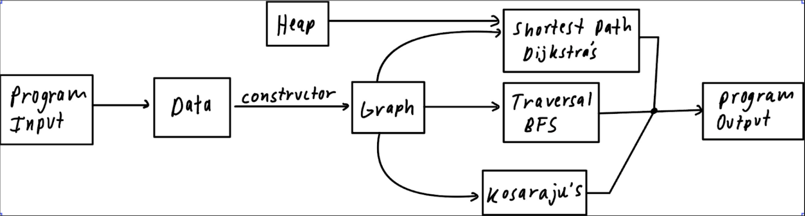

# The Wikipedia Race Game - WikiRace

  <a href="#data">Data</a> •
  <a href="#repo-structure">Repo Structure</a> •
  <a href="#running-instructions">Running Instructions</a> •
  <a href="#team">Team</a>

## Brief Overview

This project is inspired by the famous game called WikiRace, where we’re given a selected starting Wikipedia page and a destination Wikipedia page. The goal is to navigate from the starting page to the destination page solely by clicking the links embedded within each page using the fewest clicks. Utilizing some common graph algorithms like Djikstras, DFS, BFS, Kosaraju's, and variations of strongly connected components, this project was built.

## Data

In order to complete this project I needed a dataset that contained a vast amount of wikipedia hyperlinks so I used the following: [Wikipedia network of top categories](https://snap.stanford.edu/data/wiki-topcats.html) data and focusing on the following two files:

- [Hyperlink network of Wikipedia](https://snap.stanford.edu/data/wiki-topcats.txt.gz)
- [Names of the articles](https://snap.stanford.edu/data/wiki-topcats-page-names.txt.gz)

## Repository Structure

### Deliverables

- All major files that contain the functions and classes are in the [`/src`](https://github.com/smore88/WikiRace/tree/main/wikirace/src), except for the command-line input handler which is stored in `main.cpp` in [`/entry`](https://github.com/smore88/WikiRace/tree/main/wikirace/entry). The structure of how those files/classes interact with our project is outlined in the [Project Structure](#project-structure) below.
- The “wiki-topcat” dataset pulled from Stanford SNAP is stored in [`/data`](https://github.com/smore88/WikiRace/tree/main/wikirace)  once you make the folder and import the .txt files as in the [Running Instructions](#running-instructions). The “small” and “medium” datasets used in testing are stored in [`/test_data`](https://github.com/smore88/WikiRace/tree/main/wikirace/test_data). All data is stored in .txt files
- Test cases are in the [`/tests`](https://github.com/smore88/WikiRace/tree/main/wikirace/tests)
- The written project report, development log, contract, and project proposal are in the [`/Documents`](https://github.com/smore88/WikiRace/tree/main/Documents)

### Project Structure

  

## Running Instructions

### Setting up 
1. Open up your Terminal
2. `cd` into the folder containing cs225 Dockerfile
3. `git clone https://github.com/smore88/WikiRace.git`
4. `cd WikiRace-225FinalProject/wikirace`
5. `mkdir data`
6. Download the two .txt files [here](https://drive.google.com/drive/folders/1n6MIdoUR8Jymwy0taQ4BBBIdNCVNGVSm?usp=share_link) to use our data set
7. Drag them into the `data` folder you just created in step 5
    - If you want to use other data sets, move it into this `data` folder as well
8. `mkdir build`
9. `cd build`
10. `cmake ..`
11. If you want to run the algorithms, skip to the [Executable](#executable) part. If you want to run the test suites, skip to the [Tests](#tests) part.
    - Feel free to watch our [Demo video](https://youtu.be/Bxm03RmKXgg) on how to run the Executable and Test suites

### Executable
1. From the build directory, run `make main`
2. Run `./main (path to data labelling connections between pages) (path to data containing ID and name) (path to output file)`
    - For example, `./main ../test_data/test_data_medium.txt ../test_data/test_name_medium.txt ./output.txt`
3. Answer the sequence of questions prompted on the terminal
5. Upon successful run, you’ll see the following message:
      

        
      

### Tests
1. From the build directory, run `make test`
2. Run `./test` to run all test cases, or run each individual test by running `./test (test_case_name)`
3. Upon successful run, you’ll see the following message (it might take a while):
      

        
      

We constructed the small and medium sized datasets in the [`/test_data`](https://github.com/DylanDunham03/WikiRace-225FinalProject/tree/main/wikirace/test_data) directory, which is used to evaluate our algorithms' correctness. We made those datasets include both the cycles and disconnected components, so that we can test our algorithms on these edge cases as well. 

Our tests cover running the constructor, BFS algorithm, Dijkstra's algorithm, and Kosaraju's algorithm on our small dataset, medium dataset, and the whole dataset. One exception is that, for the Kosaraju's algorithm running on the whole dataset, we tested it only on cutted dataset which contains 800,000 edges (due to the limitations of stack overflow from recursive calls), yet, it still shows that our algorithm works for general datasets with smaller sizes.

